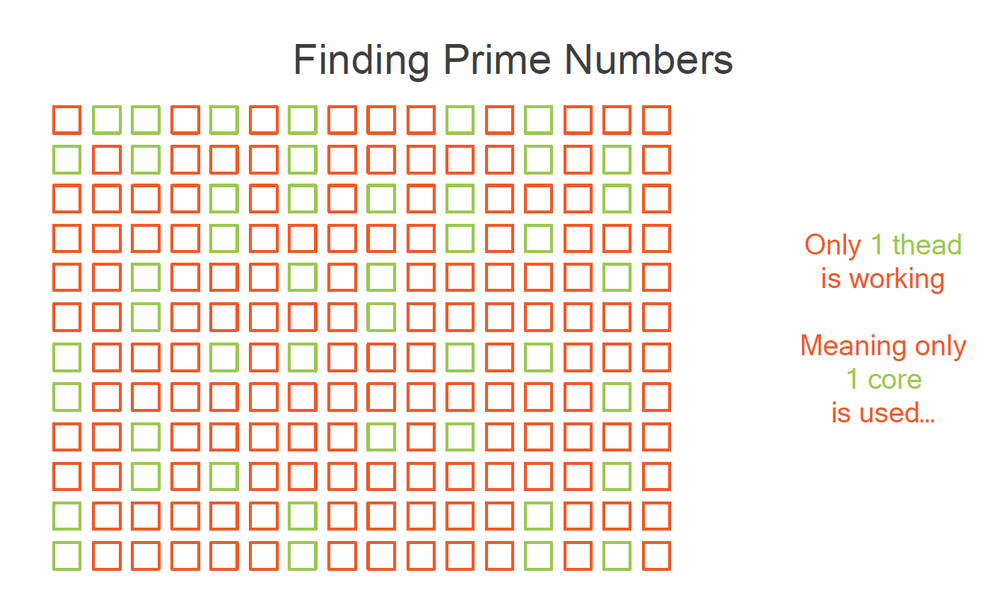
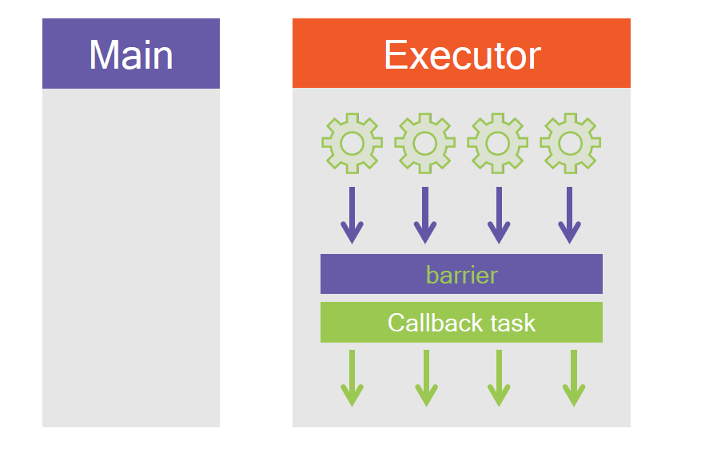

使用Barriers 和锁存器( latches)控制并发应用程序。让我们快速浏览一下本文agenda。我们将会讨论另外两个并发原语。在上一个模块中，我们看到了锁、读写锁和信号量。在这里，我们将看到Barriers 和latches。Barriers 的作用是让几个任务互相等待，然后触发一个后续的任务或动作，然后重置系统，让它可以再次运行。出于这个原因，这个Barriers 被称为CyclicBarrier。latches的工作方式几乎相同，主要区别在于它不重置。一旦锁存器被打开，它就不能再被关闭。下面会详细讲述细节。

!!! Important
+ The **barrier**: to have several tasks waitfor each other
+ The **latch**: to count down operationsand let a task start


#### 在线程间共享任务并合并结果

让我们先来谈谈障碍。假设我们需要计算一些繁重的计算，并且我们想在几个线程之间分享这个计算。这是一个非常经典的用例。我们可以做的是把我们的数据集分给几个线程。每个线程都有一个子任务，我们所期望的是每个线程都能在我们的CPU的特定调用下执行。当所有的线程都完成后，我们需要做的是收集所有的计算结果并将其合并，所以我们需要一些后续的任务被触发来完成这个合并操作。让我们举一个非常经典的例子，寻找某一数值以内的素数。这里我们有192个数字需要检查。在这一点上你可以相信我。这里有相应的素数。如果我们以经典的方式启动这个任务，只有一个线程在工作，我们的CPU只有一个核心在做这个计算。当然，现在我们的CPU上有更多的一个核心。在核心I5或核心I7上，有4个物理核心和4个逻辑核心，所以我们应该能够比这快得多。



怎样才能做到这一点呢？ 我们可以把这个数据集分成四组，并把每组送到我们CPU的一个核心上。因此，第一个核心将在自己的组上找到素数，然后是第二个，然后是第三个，然后是第四个。现在，所有这些核心完全在同一时间结束计算的可能性非常小。它们要做的计算并不完全相同。它们可能会被操作系统打断来联系其他任务，所以它们不会在同一时间结束。但是一旦它们都完成了计算，我们需要做的是收集所有的部分结果，并将它们添加到结果列表中，以计算出这次计算的最终结果。所以一旦所有的事情都完成了，我们需要触发这种回调任务来结束计算。那么，我们需要从这个API中得到什么呢？首先，我们需要一种方法将计算分布在几个线程上，我们需要知道所有的线程什么时候完成了他们的任务，这样我们就可以在那一刻启动一个回调，一个后处理任务。

#### 创建可调用任务并设置障碍
让我们看看代码如何返回。首先，我们需要一个任务，它将接收一组数字，并返回这个任务在这组数字中找到的素数集合。这个任务可以用一个可调用的接口来实现，这个接口我们在本课程的第一个模块中已经看到了。而我们将使用另一个叫做`CyclicBarrier`的对象。我们刚刚写的可调用程序将被启动数次，有不同的输入集，每个可调用程序将在自己的线程中并行启动。现在，我们需要知道所有的任务何时完成，为此，我们将使用这个`CyclicBarrier`对象。传递给这个对象的构造的参数是将被启动的任务的数量，屏障将控制这些任务。这个`CyclicBarrier`类型实际上是`java.util.concurrent`包的一个具体类，是j`ava.util.concurrent` API的一部分。

```java
    // 01 
    Callable<List<Integer>> task= () -> findPrimes(inputSet);

    // 02 
    CyclicBarrier barrier=newCyclicBarrier(4);

    // 03
    Callable<List<Integer>> task= () -> {
        Set<Integer> result= findPrimes(inputSet);
        try{
            barrier.await();// Blocks until everybody is ready
        } catch(Exception e) {
            ...
        }
        return result;
    }
```



#### CyclicBarrier模式

让我们看看这个任务的完整模式。所以我们将调用这个findPrimes方法，这个方法将从输入的集合中提取素数，一旦这个工作完成，一，结果被计算出来，我们将调用这个`barrier.await`方法，这个await方法将阻塞，直到所有人都准备好了，也就是我们刚刚返回的所有可调用程序都完成计算。这就是我们可以用来告诉可调用程序等待屏障打开的模式。事实上，这个 await 调用会阻塞，直到不同的线程对它进行了4次调用，4是我们在建立这个屏障时作为参数传递的数字。那么，它是如何精确工作的呢？我们在主线程中创建了四个可调用对象和一个屏障对象。所有这些可调用程序都被传递给我们在`Executor`模式中看到的`executor.submit`方法。它们将在`ExecutorService`中被执行，屏障暂时被关闭，这是它被创建时的默认状态。所有这些任务都将计算数据集，我们都调用这个障碍对象的等待方法。**现在这个屏障对象将计算这个等待方法被调用了多少次，当这个调用次数与这个屏障被创建的次数一致时，它将打开并让线程继续执行**。之后，我们可以设置一个回调任务，当屏障被打开时就会被触发。

看一下代码。我们将创建一个Worker类，实现`List<Integer>`的Callable。在这个类中，我们有两个字段，首先是inputList，这个worker应该在其中找到质数和我们刚刚谈到的障碍。可调用接口的调用方法只是做我们在文提到的。它在输入列表中找到质数，然后调用屏障的等待方法。这是主线程的代码。首先，我们在四个任务上创建一个CyclicBarrier。当然，我们需要一个有适当数量线程的ExecutorService。我们需要多少个工作者就创建多少个，可能是四个工作者，因为我们有一个屏障和四个任务。我们把工人一个一个地提交给这个ExecutorService，得到一个Future，然后从不同的Future中得到结果，并把它们汇集到最终结果中。

```java
public class Worker implements Callable<List<Integer>>{
    private CyclicBarrier barrier;
    private List<Integer> inputList;
    public void Worker(CyclicBarrierbarrier, List<Integer>inputList) {
        this.barrier= barrier;
        this.inputList= inputList;
    }
    public List<Integer> call() {
        List<Integer> result = findPrimes(inputList);
        try{
            barrier.await();
        } catch(InterruptedException| BrokenBarrierExceptione){
        // Error handling
        }
        return result;
    }
}

    CyclicBarrier barrier= new CyclicBarrier(4);
    ExecutorService service= Executors.newFixedThreadPool(4);
    Worker worker1= new Worker(barrier,inputList1);
    // More workers
    Future<List<Integer>> future1= service.submit(worker1);
    // More submissions
    List<Integer> finalResult= new ArrayList<>(future1.get());
    finalResult.addAll(future2.get());
    // More results
```
我们刚刚看到，这个await调用是一个阻塞调用。现在，这个屏障API的设计理念与我们在前一个模块中看到的前几个API相同，主要是锁和信号灯。事实上，我们有两个版本的await方法，一个是无限期阻塞的，一个是可以超时的，假设它再次被阻塞，然后在屏障没有打开的情况下例外地返回一个InterruptedException。一旦打开，屏障通常会被重置，也就是说它将会打开，让线程通过，然后再关闭。屏障上有一个重置方法，所以我们可以在屏障上手动调用重置。它将会打开屏障，但会例外地打开它。所以所有等待的线程，所有在这个屏障上等待的任务在这种情况下都会抛出一个BrokenBarrierException。在其他情况下，BrokenBarrierException也会被抛出。如果一个线程在等待屏障时被打断，它就会被抛出，所以打断一个正在等待某个屏障的线程会导致其他线程抛出这个BrokenBarrierException，如果屏障被手动重置，就像我们刚才看到的，当一些线程在等待屏障打开时，它也会被抛出。

!!! Notes
    The await() call is blocking  
    There are two versions:   
    -  `await()`  
    -  `await(time, timeUnit)`  
    Once opened a barrier is normally **reset**  
    The `reset()` method  
    resets the barrier exceptionnally, causing the waiting tasks to throw a `BrokenBarrierException`  

#### CyclicBarrier 总结
现在让我们快速总结一下我们在这个CyclicBarrier上看到的东西。CyclicBarrier是一个工具，我们可以用它来同步几个线程，当它们达到一个共同点时，让它们继续进行工作。CyclicBarrier在创建时是关闭的，当所有的线程都达到这个共同点时就会打开，然后会再次关闭，允许循环计算。它也可以被手动重置，但在这种情况下，这个屏障上的等待线程会抛出一个BrokenBarrierException。最后，还可以对等待屏障打开的线程设置超时。因此，如果我们的计算出了问题，系统没有被阻塞，线程仍然可以被释放，当然，会出现InterruptedException。
!!! Notes
    A BrokenBarrierExceptionis raised if:  
    -  a thread is interruptedwhile waiting  
    -  the barrier is resetwhile some threads are waiting

### 锁存器(Latch)，一个无法重置的障碍物( Barrier )
现在让我们来谈谈latches。锁存器是与障碍物密切相关的对象，但它是不一样的，我们将看到它们之间的区别。让我们来看看一个新的用例。我们需要启动我们的应用，这个应用是一个相当复杂的应用。它依赖于许多服务，比如AuthenticationService、访问数据库的DataService、处理客户订单的OrderService，可能还有很多。当然，我们需要确保在我们启动主程序之前，所有这些服务的属性都已启动。所以在为客户提供服务之前，我们的应用程序需要确保所有这些资源都被正确地初始化了。看起来这对CyclicBarrier是个问题。问题是，一旦所有的服务都可用，一旦它们的所有属性都启动了，我们就需要启动我们的应用程序，但我们不希望屏障被重置。我们不希望屏障再次关闭，因为它可能会阻止一切，系统会觉得有些服务没有被正确启动。因此，在这种情况下，我们不能使用这个对象，因为这个障碍是循环的。事实上，我们需要的是一种一旦打开就不能再关闭的屏障，这正是我们现在要看到的这个叫做倒计时锁的新对象的工作。

#### 倒计时锁存器 (CountdownLatch)
CountdownLatch的工作原理与CyclicBarrier几乎相同。假设我们在主线程中有三个可调用的任务和一个Latch对象。我们把所有东西都传给ExecutorService，我们的任务就会执行。在某些时候，我们所有的任务都将在锁存器上等待，这将产生与屏障相同的效果。它将打开latches，让任务继续执行。但最大的区别是，锁存器并不重置。它不会再次关闭。

#### CountDownLatch的实践
我们创建一个ServiceWorker。这个worker的任务是启动一个给定的服务，考虑一下AuthenticationService之类的。它实现了可调用性。当我创建这样一个工作者时，我向它传递一个给定的锁存器和我想启动的服务，这个可调用接口的调用方法实现做了两件事。首先，它调用该服务的init方法，该方法将正确初始化该服务。这可能需要一些时间，特别是如果我有网络访问之类的。而一旦完成，我就要调用这个Latch对象的倒计时方法。在主线程方面，我创建了这个CountDownLatch对象，有三个服务要启动。这个CountDownLatch类是一个来自Java.util.Concurrent包的类。然后是有四个线程的ExecutorService。然后我可以根据我的需要创建尽可能多的工作者来初始化我的服务。在这里，我假设我有三个服务。我将在我的Executor中提交这些工作者。这个Executor将执行它们，然后我所要做的就是通过调用它的await方法来等待这个latch的打开。这个等待方法将被阻塞，直到锁存器的计数达到0，当这种情况发生时，我可以调用我的server.start方法来启动我的整个服务器，这将触发对客户的服务。现在我使用了带有超时方法的await。它将只阻塞10秒，我想这足够启动我的应用程序了。

```java
    //Service worker
    public class ServiceWorker implements Callable<List<Integer>>{
        private CountDownLatch latch;
        private Service service;
        public boolean Worker(CountDownLatch latch, Service service) {
            this.latch= latch;
            this.service= service;
        }
        public void call() {
            service.init();
            latch.countDown();
        }
    }

    //  user logic
    CountDownLatch latch= new CountDownLatch(3);
    ExecutorService executor=Executors.newFixedThreadPool(4);
    ServiceWorker worker1= new ServiceWorker(latch,dataService);
    // More workers
    Future<Boolean> future1= executor.submit(worker1);
    // More submissions
    try{
        latch.await(10, TimeUnit.SECONDS); // blocks until the count reaches 0
        server.start();
    } catch(InterruptedExceptione){
        // Error handling
    }
```
所以我们现在可以把这个简单的对象CountDownLatch包装起来。这个锁存器只是一个工具，用来检查不同的线程是否正确完成了他们的任务。一旦完成，我们就可以在最后一个完成的任务上同步开始后续的任务。与CyclicBarrier不同的是，CountDownLatch一旦打开，就不能再关闭，所以它是控制应用程序启动的一个非常好的工具。
!!!Notes 
    CountDownLatch:  
        检查不同线程是否完成任务的工具  
        最后一个完成的任务上同步开始后续的任务  
        一旦打开CountDownLatch，就不能再关闭


### 编码实践
####   1. 带回调任务的CyclicBarrier

以下是一个完整的CyclicBarrier例子，其中有一个正在运行的CyclicBarrier，然后几个线程将做一些事情，触发这个屏障，并最终打开屏障触发一个调用。
假设我们有四个朋友决定一起去看电影，他们也想一起排队，但当然，他们住在城市的不同地方，所以他们决定在附近的咖啡馆见面，然后一起去看电影。所以朋友是由一个Callable建模的。Callable接口的调用方法如下。朋友到达咖啡馆需要一个随机时间。当它到达咖啡馆时，它只是打印出这样的信息，我刚刚到达，我正在等待其他人，然后等待其他人意味着调用这个障碍。 等待方法。正如我们在幻灯片中看到的，这个方法的调用是阻塞的，直到对它的调用达到一个设定的数量。一旦达到这个调用的数量，屏障就会打开，代码就可以继续，让我们去电影院，然后返回ok。我们将如何使用这段代码呢？让我们在四个线程上创建一个执行者服务，在4的计数上创建一个CyclicBarrier，并创建4个朋友，当然，他们将共享同一个屏障对象。我们将把这些可调用对象提交给同一个执行者服务，并在这个期货列表中积累期货。然后我们将调用每个期货的get方法，如果执行过程中出现异常，则打印出任何信息。让我们运行这段代码。它按预期执行。所有四个朋友将在随机时间到达咖啡馆，然后当这四个朋友都在那里时，他们将一起去电影院。请注意，我们还可以传递一个任务，在障碍物打开之前执行。这个任务实际上是一个可运行的任务，所以让我们直接打印出一个消息Barrier Opening并执行这个结果。而事实上，这个任务已经在我们等待的等待方法的线程释放之前被执行了。
```java
// package org.paumard.barriers;

import java.util.ArrayList;
import java.util.List;
import java.util.Random;
import java.util.concurrent.Callable;
import java.util.concurrent.CyclicBarrier;
import java.util.concurrent.ExecutionException;
import java.util.concurrent.ExecutorService;
import java.util.concurrent.Executors;
import java.util.concurrent.Future;
import java.util.concurrent.TimeUnit;
import java.util.concurrent.TimeoutException;

public class BarrierInAction {

	
	public static void main(String[] args) {

		class Friend implements Callable<String> {

			private CyclicBarrier barrier;
		
			public Friend(CyclicBarrier barrier) {
				this.barrier = barrier;
			}
			
			public String call() throws Exception {
				
				try {
					Random random = new Random();
					Thread.sleep((random.nextInt(20)*100 + 100));
					System.out.println("I just arrived, waiting for the others...");
					
					barrier.await();
					
					System.out.println("Let's go to the cinema!");
					return "ok";
				} catch(InterruptedException e) {
					System.out.println("Interrupted");
				}
				return "nok";
			}
		}
		
		ExecutorService executorService = Executors.newFixedThreadPool(4);

		CyclicBarrier barrier = new CyclicBarrier(4, () -> System.out.println("Barrier openning"));
		List<Future<String>> futures = new ArrayList<>();
		
		try {
			for (int i = 0 ; i < 4 ; i++) {
				Friend friend = new Friend(barrier);
				futures.add(executorService.submit(friend));
			}
			
			futures.forEach(
				future -> {
					try {
						future.get();				
						// future.get(200, TimeUnit.MILLISECONDS);				
					} catch (InterruptedException | ExecutionException e) {
						System.out.println(e.getMessage());
					// } catch (TimeoutException e) {
					// 	System.out.println("Timed out");
					// 	future.cancel(true);
					}
				}
			);
			
		} finally {
			executorService.shutdown();
		}
	}
}

```
```text
I just arrived, waiting for the others...
I just arrived, waiting for the others...
I just arrived, waiting for the others...
I just arrived, waiting for the others...
Barrier openning
Let's go to the cinema!
Let's go to the cinema!
Let's go to the cinema!
Let's go to the cinema!
```

####  2. 设置ExecutorService，使用TimeOut
所以我们刚刚看到了一切正常的情况。现在让我们看看如何撤销异常和超时。让我们看看第一个可能出错的情况。所有的可调用程序都在我们的ExecutorService的一个给定的线程中执行。这个等待方法阻塞了这些线程，但它们并没有释放它们。因此，如果我在CyclicBarrier上的计数是4，我需要在我的Executor中至少有4个线程可用。如果不是这样的话，就意味着这个障碍物永远不会打开。让我们来看看。让我们在这个执行器中放入两个线程。第一个可调用的两个线程将被正确执行，并等待屏障打开，但由于这个Executor没有任何可用的线程来执行另外两个任务，它们将永远不会被执行，这个屏障也将永远不会打开。现在，我们如何处理这个障碍永远不会打开的事实，或者至少，需要很长的时间，太多的时间才能正常打开。好吧，这个await方法有几个版本，其中有一个版本需要一个超时作为参数。让我们把这个超时设置为一个高值，比如5秒，看看会发生什么。我们所期待的是以下情况。我们有两个任务将被正确执行，所以这个await方法将为它们执行，但其他两个任务永远不会被执行。所以在某个时候，这个await方法会在5秒后抛出一个超时异常。这个超时异常将在future的这个get方法中被看到，并且这个障碍将被打破。让我们来执行这段代码。所以这就是执行的两个第一个任务，你可以看到一个超时异常和一个BrokenBarrierException一起被引发。事实上，第一个超时的任务关闭了等待方法上的另一个等待任务，抛出了这个BrokenBarrierException。所以这两个任务已经失败了。我们的ExecutorService的两个相应的线程已经被释放，它们变得可以执行两个等待任务。所以这就是我们在这里看到的，当这两个等待任务到达障碍和等待方法时，由于障碍被打破，立即抛出了BrokenBarrierException。所以在这里我们看到了两件事，如何在这个等待方法上设置一个超时。第一个超时到达的时候会抛出一个TimeoutException，可以在这个get方法中捕获。这将导致障碍的中断，所以所有对这个等待方法的其他调用将立即抛出一个BrokenBarrierException。

```java
// package org.paumard.barriers;

import java.util.ArrayList;
import java.util.List;
import java.util.Random;
import java.util.concurrent.Callable;
import java.util.concurrent.CyclicBarrier;
import java.util.concurrent.ExecutionException;
import java.util.concurrent.ExecutorService;
import java.util.concurrent.Executors;
import java.util.concurrent.Future;
import java.util.concurrent.TimeUnit;
import java.util.concurrent.TimeoutException;

public class BarrierInAction {

	
	public static void main(String[] args) {

		class Friend implements Callable<String> {

			private CyclicBarrier barrier;
		
			public Friend(CyclicBarrier barrier) {
				this.barrier = barrier;
			}
			
			public String call() throws Exception {
				
				try {
					Random random = new Random();
					Thread.sleep((random.nextInt(20)*100 + 100));
					System.out.println("I just arrived, waiting for the others...");
					
					barrier.await(5,TimeUnit.SECONDS); // add time exception
					
					System.out.println("Let's go to the cinema!");
					return "ok";
				} catch(InterruptedException e) {
					System.out.println("Interrupted");
				}
				return "nok";
			}
		}
		
		ExecutorService executorService = Executors.newFixedThreadPool(2);

		CyclicBarrier barrier = new CyclicBarrier(4, () -> System.out.println("Barrier openning"));
		List<Future<String>> futures = new ArrayList<>();
		
		try {
			for (int i = 0 ; i < 4 ; i++) {
				Friend friend = new Friend(barrier);
				futures.add(executorService.submit(friend));
			}
			
			futures.forEach(
				future -> {
					try {
						future.get();				
						// future.get(200, TimeUnit.MILLISECONDS);				
					} catch (InterruptedException | ExecutionException e) {
						System.out.println(e.getMessage());
					// } catch (TimeoutException e) {
					// 	System.out.println("Timed out");
					// 	future.cancel(true);
					}
				}
			);
			
		} finally {
			executorService.shutdown();
		}
	}
}

```

输出：
```text
I just arrived, waiting for the others...
I just arrived, waiting for the others...
java.util.concurrent.TimeoutException
java.util.concurrent.BrokenBarrierException
I just arrived, waiting for the others...
java.util.concurrent.BrokenBarrierException
I just arrived, waiting for the others...
java.util.concurrent.BrokenBarrierException
```


#### 3.future超时和任务取消
第二种处理方式如下。我们已经从这个await调用中删除了超时，我们可以在这个future.get调用上再放一个超时。让我们把它放在200 MILLISECONDS。这个版本的get方法可以抛出一个TimeoutException，所以我们要在周围的try TimeoutException附近添加一个catch，这里只是打印出Timed out。让我们运行这段代码。这里我们可以看到，我们的问题只得到了部分解决。为什么？因为我们所有的future都已经超时了，所以我们的主线程不再等待任何结果了。但是我们的任务仍然在等待屏障打开，我们的两个未执行的任务仍然在ExecutorService中等待，我们可以看到这里JVM仍然在运行，因为线程仍然在ExecutorService中运行，执行任务。所以给这个get方法计时并不总是取消正在运行的任务，即相应的运行任务，在这种情况下，它只是一个部分解决方案。用这个解决方案完全处理这种情况的正确方法是，一旦抛出这个TimeoutException，通过调用future.cancel取消相应的任务，并传递true，因为我们要中断当前运行的任务和在ExecutorService中等待可用线程的任务。如果我们按原样运行这段代码，在我们的应用程序已经正常退出的情况下，它将起作用，所以这意味着ExecutorService已经被关闭，所有的任务都被取消了，但如果我们想更准确地看到它，我们需要用一个try catch来包围这段代码，在这里捕获InterruptedException，打印出一个消息，比如说Interrupted，并返回nok。如果我们到达代码的这一点，让我们再次运行这段代码，现在我们可以看到每个任务都超时了，然后被取消方法的调用打断。
```java

// package org.xkx.barriers;

import java.util.ArrayList;
import java.util.List;
import java.util.Random;
import java.util.concurrent.Callable;
import java.util.concurrent.CyclicBarrier;
import java.util.concurrent.ExecutionException;
import java.util.concurrent.ExecutorService;
import java.util.concurrent.Executors;
import java.util.concurrent.Future;
import java.util.concurrent.TimeUnit;
import java.util.concurrent.TimeoutException;

public class BarrierInAction {

	
	public static void main(String[] args) {

		class Friend implements Callable<String> {

			private CyclicBarrier barrier;
		
			public Friend(CyclicBarrier barrier) {
				this.barrier = barrier;
			}
			
			public String call() throws Exception {
				
				try {
					Random random = new Random();
					Thread.sleep((random.nextInt(20)*100 + 100));
					System.out.println("I just arrived, waiting for the others...");
					
					barrier.await();
					
					System.out.println("Let's go to the cinema!");
					return "ok";
				} catch(InterruptedException e) {
					System.out.println("Interrupted");
				}
				return "nok";
			}
		}
		
		ExecutorService executorService = Executors.newFixedThreadPool(2);

		CyclicBarrier barrier = new CyclicBarrier(4, () -> System.out.println("Barrier openning"));
		List<Future<String>> futures = new ArrayList<>();
		
		try {
			for (int i = 0 ; i < 4 ; i++) {
				Friend friend = new Friend(barrier);
				futures.add(executorService.submit(friend));
			}
			
			futures.forEach(
				future -> {
					try {
						future.get(200, TimeUnit.MILLISECONDS);				
					} catch (InterruptedException | ExecutionException e) {
						System.out.println(e.getMessage());
					} catch (TimeoutException e) {
						System.out.println("Timed out");
						// future.cancel(true);
					}
				}
			);
			
		} finally {
			executorService.shutdown();
		}
	}
}
```

输出
```text
Timed out
Timed out
Timed out
Timed out
I just arrived, waiting for the others...
I just arrived, waiting for the others...
```

添加 `future.cancel(ture)`

```text
I just arrived, waiting for the others...
Timed out
Interrupted
Timed out
Interrupted
Timed out
Interrupted
I just arrived, waiting for the others...
Timed out
```


