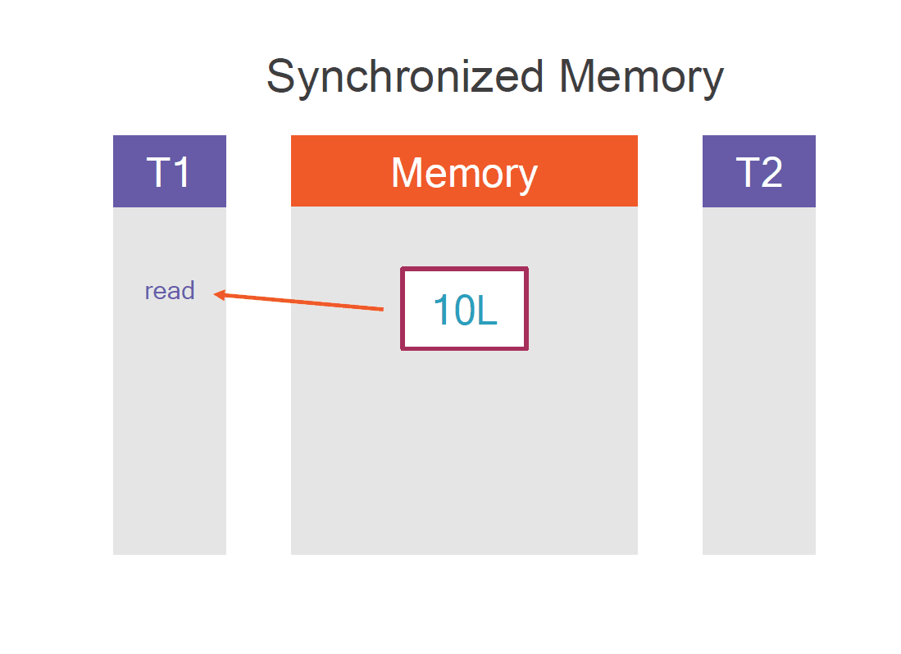

这个模块是关于CASing和原子变量的。CASing是什么意思？事实上，它的意思是比较和交换，我们将探讨它到底是什么，因为它是一个来自CPU的汇编语言的概念，在JDK中也有。我们还将看到为什么使用CASing是有用的，它与同步有什么不同，无论是使用经典同步块的同步还是使用锁接口的锁。我们将看到它在JDK中是如何实现的，以及我们可以在JDK中找到什么来实现CASing，我们会看到如何以及何时使用它。
!!! Notes
    CASing= “Compare And Swap”

### CASing 
#### 我们总是需要同步化吗？
让我们先谈谈CASing本身，也就是比较和交换，以及为什么它被添加到CPU中。出发点是一组汇编指令，这是CPU所提供的非常低级的功能。这些低级功能已经在JDK的API层面上暴露在许多其他语言中，这样我们就可以在我们的应用程序中利用它们了。那么什么是CASing呢？让我们首先说明这个问题。它所解决的问题是一个经典的并发编程问题，我们在细节上看到过。它是对共享内存的并发访问。这意味着什么呢？它意味着几个线程试图读写，所以读取和修改同一对象的相同变量。现在我们到目前为止的工具是同步工具，无论是经典的同步块还是使用锁接口。它的效果非常好。它可以防止几个线程同时修改内存的同一部分。但在某些情况下，我们有更多的工具会被证明更有效率。事实上，同步化是有成本的，我们可以问自己一个问题，是否真的总是必须使用它。事实上，我们使用它是为了确保我们的代码是正确的。但如果我们不使用它，我们真的确定我们的代码会失败吗。事实上，有很多情况下，人们忘记了同步修改内存，而代码仍然工作。这意味着，事实上，有很多情况下，真正的并发性是很少的。

#### 一个假并发的例子
让我们研究一个真实的问题，即一部分内存的访问已经被同步化了。我们有一个第一个线程T1，它读取了一个变量，假设它是long 类型，值是10，并且我们要修改它。然后另一个线程将在这之后读取并修改它。在这里，我们有一个共享的内存部分。因为我们想确保这段内存是正确的，所以我们已经同步了它的成功。但事实上，当我们的应用程序运行时，线程T1和T2并不是在完全相同的时间访问这部分内存的。他们是一个接一个地访问的。因此，由于我们很好地学习了并发的东西，我们知道我们需要写出正确的代码，我们使用了一个同步块来保护这部分内存。这种锁的保护是必不可少的，因为如果我们不这样做，两个线程在完全相同的时间内写和读代码，我们就会出现并发问题的竞赛条件。但事实上，当我们的应用程序运行时，在运行时并不存在真正的并发性，因为在我们刚才看到的情况下，T1线程并没有完全在同一时间访问这部分内存。而这恰恰是可以使用CASing的情况。


#### 工作原理
CASing是如何工作的？好吧，这种比较和交换的工作有三个参数。第一个是内存中的一个位置，所以基本上是一个地址。第二个参数是据称写在这个位置的现有值。所以这是我们认为应该在这个位置上的值。第三个参数是我们想写在这个位置的新值。所以这个新值将取代现有的值。语义是这样的。如果该地址的当前值，也就是存在于该地址的值，是我们期望的值，那么我们就用新的值替换它，并返回true。这意味着从我们上次读取这个地址到现在，没有其他线程修改过这个位置。如果不是这样，就意味着在我们最后一次读取这个位置并读取预期值和现在之间，一些线程已经修改了这个位置，所以我们观察到的是真正的并发性。因此，由于预期值不是该位置的值，我们不做任何修改，并返回false。所有这些比较和修改都是不间断进行的，都是在一个原子汇编指令中进行的。因此，在这段时间内，我们可以确定没有其他线程可以打断我们的进程。这对于CASing的工作是至关重要的。所以我们可以看到，有了这样的功能，我们就可以在不使用同步的情况下修改内存中给定位置的值，如果没有真正的并发，就像我们在前面的例子中看到的那样，它将比同步更有效率。


#### AtomicLong类
让我们看一个使用`AtomicLong`类的代码例子。AtomicLong是一个long的封装器。它可以被用来创建计数器，所以让我们来做这件事。我们在数值10上创建一个AtomicLong，然后我们只是递增并得到这个计数器，这是一个安全的递增我们所拥有的数值的方法。所以这个模式允许我们以并发的方式安全地增加计数器的值，而无需同步。在引擎盖下发生了什么？事实上，Java API将尝试应用增量。CASing实现将告诉调用代码增量是否失败。如果另一个线程在这期间修改了计数器,就会增量失败。如果增量失败，那么API将再次尝试，直到这个增量被CASing机制接受。因此，如果我们有几个线程在为同一个计数器增量，CASing会确保没有增量丢失。如果我们有4个线程对一个计数器进行了25次增量，那么这个计数器在一天结束时将保持100的数值。反过来说，很可能会有超过100次的增量被尝试。由于并发性，其中一些将不被考虑在内。

```java
// Create an atomic long
AtomicLong counter = new AtomicLong(10L);
// Safely increment the value
long newValue=counter.incrementAndGet();
```

### Java Atomic API
#### AtomicBoolean类
现在我们看到了基本原理和一些例子，让我们浏览一下API。我们有几个具有不同功能的类，无论这个类是包裹一个布尔值、一个数字，还是一个引用。每个类中都有很多方法，这让事情变得有点乏味，但我认为看到这一点仍然很重要，可以很好地了解事情是如何设计的以及它们如何工作的。所以我们首先有AtomicBoolean。我们能做什么，当然是获取和设置值。这是一个封装类，我们有这个getAndSet方法，它将返回当前值并将这个值更新为过去的值。而最后一个方法是compareAndSet，它基本上是CASing方法，有一个预期值和新的值，如果预期值被匹配，就会被设置。
!!!Notes
      + AtomicBoolean  
        - get(), set()  
        - getAndSet(value)  
        - compareAndSet(expected, value)  

#### AtomicInteger和AtomicLong类
之后，我们有AtomicInteger和AtomicLong来做计数器，获取和设置值与之前一样，getAndSet方法需要一个值，也是同一种方法，compareAndSet方法需要预期值和我们要设置的新值，这又是CASing的精确实现，我们有更多的方法需要运算符，getAndUpdate和updateAndGet。当然，GetAndUpdate将返回当前值并进行更新。UpdateAndGet将做相反的事情，首先更新，然后得到一个新的值。一个单数运算符可以用lambda表达式来实现，它只是对当前值的一个操作，将计算出新的值。而我们有更多的方法，getAndIncrement和getAndDecrement。首先，我们告诉值，然后做修改。GetAndAdd和addAndGet将用过去的值增加当前的值，getAndAdd返回现有的值，addAndGet返回更新的值。还有getAndAccumulate和accumulateAndGet，同样的语义，需要一个二进制运算符。这个二进制运算符将操作和该位置的当前值和过去的值作为一个参数来计算要在这个AtomicInteger或AtomicLong中设置的新值。

!!!Notes
      + AtomicInteger, AtomicLong  
        - get(), set()  
        - getAndSet(value)  
        - compareAndSet(expected, value)  
        - getAndUpdate(unaryOp), updateAndGet(unaryOp)  

#### AtomicReference类
然后，最后一个原子类是AtomicReference。之前所有的AtomicBoolean、AtomicInteger和AtomicLong都是对Java原始类型、布尔、int和long的包装。这个AtomicReference是对指针的引用的封装。方法的设置几乎是一样的。我们有一个get和set方法，当然，getAndSet需要一个新值，getAndUpdate需要一个单数运算符。这个单项运算符当然是在类型V上操作的。GetAndAccumulate和accumulateAndGet，需要一个值和一个建立在V类型上的二元运算符，其行为与整数和长数上的相同方法相同。最后一个是compareAndSet，在该位置的预期值，如果预期值与当前值匹配，则设置新值。

!!!Notes
      - AtomicReference <V>  
          -  get(), set()  
          - getAndSet(value)  
          - getAndUpdate(unaryOp), updateAndGet(unaryOp)  
          - getAndAccumulate(value, binOp), accumulateAndGet(value, binOp)  
          - compareAndSet(expected, value)  

#### CASing总结
因此，关于CASing的最后一句话。当并发性不是太高时，CASing工作得很好。事实上，如果并发性很高，那么内存的更新操作将被反复尝试，直到它被所有的线程所接受，而在某个特定的时间点，只有一个线程会赢。所有其他的线程将一次又一次地重试。而由此得出的结论是，CASing系统的行为与同步系统的行为非常不同。如果你同步了一部分内存，这意味着你的所有线程之间都要等待访问这部分内存。在CASing的情况下，所有的线程在同一时间都要访问这块内存，但只有一个线程会成为赢家。因此，如果CASing没有在正确的使用情况下使用，它可能会在内存和CPU上产生非常大的负载。因此，让我们对原子变量做一个小小的总结。原子变量是基于CASing的。CASing是另一个处理内存上并发读写操作的工具。这个工具的工作方式与同步化非常不同。它与同步完全不同，如果它被引入，那是因为它可以带来更好的性能。现在应该谨慎使用它，因为在并发性非常高的情况下，它将对CPU和内存产生沉重的负荷。


### 加法器和累加器(Adders and Accumulators)
现在让我们来谈谈加法器和累加器。加法器和累加器是Java 8的一个介绍。这些类在Java 7和之前是没有的。出发点是一个事实，我们在原子变量上看到的所有方法都是建立在修改和获取或获取和修改的概念上，而事实是，有时我们不需要在每次修改时获取部分。假设我们只是在创建一个计数器，我们只是想计算一定数量的事件，我们想以一种线程安全的方式来实现它，所以我们使用一个AtomicLong，比如说。每次我们递增这个AtomicLong时，我们也会得到这个AtomicLong的当前值，但事实上，我们此时并不需要这个值。我们所需要的是一旦我们的进程结束后的值。这正是Java 8中引入的LongAdder和LongAccumulator类的作用。LongAdder可以被看作是一个AtomicLong，它在每次修改时不暴露获取功能，可以优化事情。

#### 加法器和累加器的API
所以LongAdder和LongAccumulator的工作原理与AtomicLong相同。不同的是，它不会在每次修改时返回更新的值，所以如果真的有很多线程试图进行修改，它可以将更新分布在不同的单元上。最后，当我们调用get方法时，所有来自不同单元的结果都可以在这次调用中被合并。这些类的创建是为了处理非常高的并发性，大量的线程，如果不是这样的话，使用它们是很无用的。让我们浏览一下我们在LongAdder上的方法，增量和减量。它们不返回任何东西。添加，需要long作为参数。Sum、longValue和IntValue，这将返回这个LongAdder的内容，还有sumThenReset，这就是我们返回这个LongAdder的内容并将值重置为0。 对于LongAccumulator，由于这是一个累加器，它是建立在二进制运算符上的，然后我可以将这个累加起来。当前的值和这个过去的值将作为这个二进制运算符的参数来产生一个新的值，我们有一个get方法来返回这个累积器中计算的值。我们也有一个方便的方法来转换这个累积值的int, long, float, 或 double。如果我们需要在获取累加器的值时重置它，我们也有这个getThenReset方法。
Java Atomic API。AtomicReference类

!!! Notes
      - LongAdder:  
          + increment(), decrement()  
          + add(long)  
          + sum(), longValue(), intValue()  
          + sumThenReset()  
      - LongAccumulator:
          - built on a binary operator  
          - accumulate(long)  
          - get()
          - intValue(), longValue(), floatValue(), doubleValue()
          - getThenReset()

### 代码实践
#### 1.修复一个简单计数器上的竞赛条件
我们实现一些正在运行的原子计数器，我们如何使用它们，以及它们如何工作。现在让我们看看使用原子变量的线程安全计数器的运作。让我们先来看看这个非常简单的代码。这里我们有一个计数器，它只是一个整数，是私有的和静态的，我们有两个实现runnable的类，它们将为Increment Runnable增加这个计数器，为Decrementer Runnable减少这个计数器。每个类都做了1，000次，我们现在要做的就是在我们为增量器和减量器创建的8个线程的ExecutorService中执行，并发地执行它们，等待所有这些增量器和减量器完成，最后只需打印出结果。当然，这个计数器变量上有一个非常巨大的竞赛条件。这段代码就是为此而编写的。所以，虽然，结果应该是0，但在等待这段代码时，我们达到0的可能性非常小。让我们运行它并验证一下，-500和一些，-差不多700，-1，500。你看，即使我们多次运行这段代码，也没有相同的结果，如果我们在你的机器上运行这段代码，你得到和我一样的结果的可能性非常小。我们可以用第一种方法来使这段代码工作，那就是锁定所有的东西来同步这个增量和减量操作的过剩部分，这样做是没有任何问题的，但是我们要用不同的方法，把这个计数器的类型改为AtomicInteger，所以这个计数器是一个新的AtomicInteger的0，当然，我们不能对这个AtomicInteger使用++操作符。例如，我们有incrementAndGet用于增量，decrementAndGet用于减量。现在，如果我们在代码中，当然，结果是0，而且在任何类型的机器上都应该是0，因为我们已经使它成为完全线程安全的。

nomal
```java
public classCounter {

// private static MyAtomicCounter counter = new MyAtomicCounter(0);
	private static int counter = 0;
	
	public static void main(String[] args) {

		class Incrementer implements Runnable {
			
			public void run() {
				for (int i = 0 ; i < 1_000 ; i++) {
					counter++;
					// counter.myIncrementAndGet();
				}
			}
		}
		
		class Decrementer implements Runnable {
			
			public void run() {
				for (int i = 0 ; i < 1_000 ; i++) {
					counter--;
					// counter.decrementAndGet();
				}
			}
		}
		
		ExecutorService executorService = Executors.newFixedThreadPool(8);
		List<Future<?>> futures = new ArrayList<>();
		
		try {
				
			for (int i = 0 ; i < 4 ; i++) {
				futures.add(executorService.submit(new Incrementer()));
			}
			for (int i = 0 ; i < 4 ; i++) {
				futures.add(executorService.submit(new Decrementer()));
			}
			
			futures.forEach(
				future -> {
					try {
						future.get();
					} catch (InterruptedException | ExecutionException e) {
						System.out.println(e.getMessage());
					}
				}
			);
			
			System.out.println("counter = " + counter);
			// System.out.println("# increments = " + counter.getIncrements());
			// System.out.println("# increments = " + counter);
			
		} finally {
			executorService.shutdown();
		}
	}
}
```
#### 2. 原子整数中计算重试的次数
让我们看看这个增量和减量是如何工作的，为此，我把我们使用的计数器的实现修改为MyCounter类，让我们看看。这个MyAtomicCounter类扩展了AtomicInteger。它有这个不安全的私有静态字段，在这里初始化。现在这个代码块绝对不应该被添加到任何类型的应用程序中。它只是为了演示，所以不要在你的应用程序中这样做。这个myIncrementAndGet方法是对AtomicInteger类的incrementAndGet方法的一个修改。基本上，它是完全相同的方法。唯一的区别是在这里我增加了一个叫做countIncrement的内部计数器，我可以得到这个countIncrement计数器的值来计算这个AtomicInteger的内部值的增加失败次数。正如我们在幻灯片中看到的，incrementAndGet试图对内存中的特殊位置进行增量，如果这个增量是由两个线程同时进行的，其策略如下，两个线程中的一个能够进行增量，另一个则必须重试。这个重试就在这里，getIntVolatile of valueOffset，这是内存中的位置，然后比较AndSwapInt valueOffset的这个位置，v是预期值，v+1是绑定的新值，取代之前的1。现在，如果另一个线程正在做同样的事情，v将不是该位置的预期值，并且这个compareAndSwapInt将返回false，从而触发了对该位置增量的再次尝试。所以代码的其余部分都是一样的。我们只是在这个操作结束时打印出计数器的值。当然，它应该仍然是0，但我们也要打印出增量操作被尝试和重试的次数。我们有四个增量器。每个递增器将计数器递增1，000次，所以最少的重试次数是4，000次。让我们执行这段代码，我们可以看到，它远远超过了4，000，几乎是两倍。我们可以多次执行这段代码，看到每次运行的结果都不一样，这是非常正常的，如果你运行这段代码，你也不应该期望在你的机器上有同样的结果。所以这显示了AtomicInteger的行为。事实上，即使并发性很低，AtomicInteger也必须重试修改它所持有的值，这对我们在Atomic API中的所有原子变量都是一样的。
atomic

```java
package org.xkx.atomiccounter;

import java.lang.reflect.Field;
import java.util.ArrayList;
import java.util.List;
import java.util.concurrent.ExecutionException;
import java.util.concurrent.ExecutorService;
import java.util.concurrent.Executors;
import java.util.concurrent.Future;
import java.util.concurrent.atomic.AtomicInteger;

import sun.misc.Unsafe;

public class AtomicCounter {

	private static class MyAtomicCounter extends AtomicInteger {
		
		private static Unsafe unsafe = null;
		
		static {
			Field unsafeField;
			try {
				unsafeField = Unsafe.class.getDeclaredField("theUnsafe");
				unsafeField.setAccessible(true);
				unsafe = (Unsafe) unsafeField.get(null);
			} catch (Exception e) {
				e.printStackTrace();
			}
		}
		
		private AtomicInteger countIncrement = new AtomicInteger(0);
		
		public MyAtomicCounter(int counter) {
			super(counter);
		}
	
		public int myIncrementAndGet() {

			long valueOffset = 0L;
			try {
				valueOffset = unsafe.objectFieldOffset(AtomicInteger.class.getDeclaredField("value"));
			} catch (NoSuchFieldException | SecurityException e) {
				e.printStackTrace();
			}
			int v;
	        do {
	            v = unsafe.getIntVolatile(this, valueOffset);
	            countIncrement.incrementAndGet();
	        } while (!unsafe.compareAndSwapInt(this, valueOffset, v, v + 1));
	        
	        return v;
		}
		
		public int getIncrements() {
			return this.countIncrement.get();
		}
	}
	
	private static MyAtomicCounter counter = new MyAtomicCounter(0);
	
	public static void main(String[] args) {

		class Incrementer implements Runnable {
			
			public void run() {
				for (int i = 0 ; i < 1_000 ; i++) {
					counter.myIncrementAndGet();
				}
			}
		}
		
		class Decrementer implements Runnable {
			
			public void run() {
				for (int i = 0 ; i < 1_000 ; i++) {
					counter.decrementAndGet();
				}
			}
		}
		
		ExecutorService executorService = Executors.newFixedThreadPool(8);
		List<Future<?>> futures = new ArrayList<>();
		
		try {
				
			for (int i = 0 ; i < 4 ; i++) {
				futures.add(executorService.submit(new Incrementer()));
			}
			for (int i = 0 ; i < 4 ; i++) {
				futures.add(executorService.submit(new Decrementer()));
			}
			
			futures.forEach(
				future -> {
					try {
						future.get();
					} catch (InterruptedException | ExecutionException e) {
						System.out.println(e.getMessage());
					}
				}
			);
			
			System.out.println("counter = " + counter);
			System.out.println("# increments = " + counter.getIncrements());
			
		} finally {
			executorService.shutdown();
		}
	}
}

```


```text
counter = 0
# increments = 5652
```


