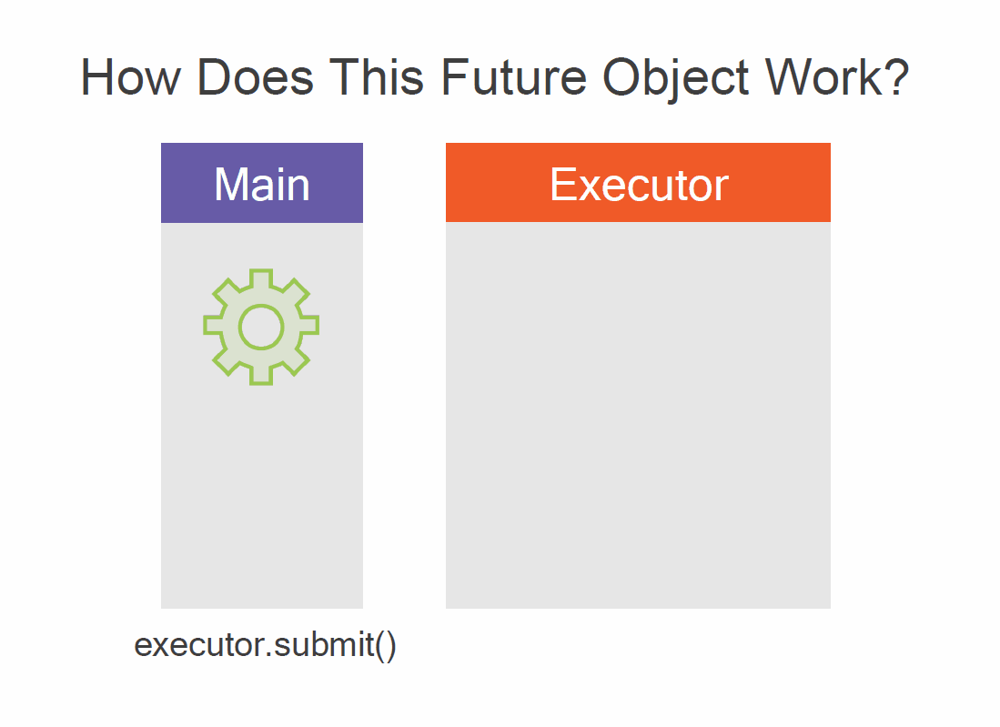

高级Java并发模式，及其第一个模块，介绍执行器模式、期货和可调用程序。本课程是关于Java中的高级并发，主要是指如何以不同的方式改进Runnable模式。首先，我们将讨论Executor模式以及期货和可调用程序。我们将详细介绍这些内容。然后，我们将讨论引入的用于同步任务的Java原语。这些原语已在Java 5中引入。然后我们将详细介绍比较和交换模式以及原子变量。我们将非常精确地描述这个概念。最后，我们将浏览集合框架中引入的并发集合和地图。在涵盖Java并发原语的模块中，我们将介绍锁和信号灯，它们是同步块模式的替代品，我们将用它们来实现生产者/消费者模式。我们还将讨论障碍物和锁，并看到正确使用它们的模式。

### Executor

#### Runnable模式的问题
让我们开始第一部分，关于Executor模式。首先，让我们看一下这段代码。这段代码是Runnable模式的一个实际例子。首先，一个任务是Runnable接口的一个实例。由于这个Runnable接口是一个功能接口，我们可以用一个lambda表达式来实现它。然后，我们创建一个新的线程类的实例，并将这个Runnable作为参数传递给这个对象的构造。最后，我们在这个Thread对象上调用start方法，这将产生在一个新的线程中执行runnable的效果，从而执行这个任务。现在让我们仔细看看这个模式，并尝试了解它的问题所在。第一点是，线程是由用户根据需求创建的。这个用户是一个开发者。现在的风险是，每个人都可以自由地创建新的线程，你可能最终会在你的应用程序中创建成千上万的线程，从而扼杀它。这个想法不是一个好主意。第二，为每个任务创建一个新的线程，当任务完成后，该线程就会死亡。这就是这种启动方法的工作方式。问题是，线程可能是操作系统给的资源，而我们都知道，这些资源无论是创建还是杀死都很昂贵。因此，事实上，这种模式，即使从纯技术角度看是可行的，也不是那么好，不应该在实际应用中使用。事实上，如果你正在开发的是一个Java EE应用程序，你根本就不应该使用它。在Java EE应用程序中，你不允许自己创建新的线程。
```java
    Runnable task= () -> System.out.println('Hello world!');
    Thread thread= newThread(task);
    thread.start();
```

#### Executor 一种启动线程的新模式
Executor模式的第一个目标正是要解决这些问题。因此，首先，我们怎样才能改善用户线程的资源。我们可以考虑创建随时可以使用的线程池，这是一个非常经典的解决方案，并按需使用它们。因此，我们不是用每个任务作为参数来创建一个新的线程，而是像实现Runnable接口那样创建任务，并将其提交给线程池来执行。线程池的作用将是接受一个任务，选择一个可用的线程，将这个任务传递给这个线程，并在这个线程中执行它。因此，我们至少需要两种模式，第一种模式是创建一个线程池，第二种模式是将一个任务传递给这个线程池。


在Java中，一个线程池是一个Executor接口的实例。这个Executor接口非常简单。它只有一个方法，即execute，它需要一个可运行的任务。我们不需要自己去实现这个接口。在JDK中有几个现成的实现。我们有第二个接口，叫做ExecutorService，它扩展了Executor。ExecutorService比Executor多了大约10个方法，但事实上，事实证明，Executor的所有实现也是ExecutorService的实现。两个接口的实现都是一样的。为了创建这些实现的实例，我们有一个名为Executors的工厂类，其中的S有大约20个方法来创建Executor。例如，让我们建立一个只有一个线程的线程池。我们可以使用Executors类中的newSingleThreadExecutor工厂方法。这个线程池是如何工作的呢？事实上，当我们创建它时，这个线程也被创建了，只要这个线程池还活着，它就会一直活着。然后，当我们把一个任务传递给这个ExecutorService时，这个任务就会在这个线程中执行，一旦这个任务完成，这个线程就会被销毁。这就带来了一个问题：我们要如何释放这个ExecutorService的线程。事实上，在ExecutorService中，有一组关闭方法，我们将在这一部分的最后看到。

```java
    public interface Executor {
        void execute(Runnabletask);
    }

    public interface ExecutorService extends Executor {
        // 11 more methods
    }
```

#### Runnable 和 Executor Service  模式
我们不会看到Executors工厂类的所有方法。我们将在本模块的现场编码部分看到几个例子。这个类中最常用的两个方法是以下几个。第一个是newSingleThreadExecutor，用来创建一个只有一个线程的线程池。当你只想在另一个线程中执行一个任务时，它对于反应式编程非常有用。第二个是FixedThreadPoolExecutor。它是一个线程池，你可以固定线程的数量，在这个例子中是8。好了，我们可以在一个单线程上创建一个执行器，然后像我们刚才那样创建一个可运行的任务，并将这个任务传递给执行器。将要发生的事情是，执行器将接受这个任务，因为它只有一个线程，所以将在这个线程中执行这个任务。当这个任务完成后，这个线程就可以用来执行另一个任务了。所以我们可以比较这两种模式。在第一种模式中，我们将任务传递给执行器。在第二种模式中，我们将任务传递给一个新的线程实例。所以基本上，Executor模式不会创建一个新的线程，这正是我们想要做的，但行为是一样的。执行方法的调用和启动方法的调用都将立即返回，任务将在未来的某个时间在另一个线程中执行。

```java
    ExecutorService singleThreadExecutor =Executors.newSingleThreadExecutor();
    ExecutorService multipleThreadsExecutor = Executors.newFixedThreadPoolExecutor(8);

    //
    Executor executor= Executors.newSingleThreadExecutor();
    Runnable task= () -> System.out.println("I run!");
    executor.execute(task);

    // Executor pattern
    executor.execute(task);
    // Runnable pattern
    newThread(task).start();
```

现在假设我们运行这段代码。我们在单线程上创建一个Executor，创建一个需要一定时间执行的第一个任务，以及一个也需要一定时间执行的第二个任务，我们将这两个任务提交给同一个Executor。所以很明显，task2将不得不等待task1的完成。因此，为了处理这种情况，一个Executor，不管它是否是单线程的，都要有等待队列。现在，这个等待队列被精确地指定。它是如何工作的呢？首先，当没有线程可用时，一个任务被添加到等待队列中。因此，假设我们有一个建立在全线程上的ExecutorService，而且所有的线程都很忙。如果一个新的任务被提交，它将被添加到这个等待队列中。第二条规则是，任务是按照提交的顺序来执行的。所以在我们的例子中，我们可以保证任务1在任务2之前被执行。这对于我们的任务排序是非常重要的。但当然，还可以提出更多问题。首先，我们能否知道一个任务是否已经完成。第二个问题，我们能否取消一个任务的执行。第一个问题的答案是否定的。事实上，在这种情况下，当我们使用runnable时，不可能通过查询Executor来知道某个任务是否被执行。第二，我们能否取消任务的执行。在某种程度上，我们可以。事实上，我们能做的是将一个任务从等待队列中移除。如果任务已经被线程启动，那么就不可能取消它。

```java
    Executor executor= Executors.newSingleThreadExecutor();
    Runnable task1= () -> someReallyLongProcess();
    Runnablet ask2= () -> anotherReallyLongProcess();
    executor.execute(task1);
    executor.execute(task2);

// Can we know if a task is done or not? No…
// Can we cancel the execution of a task? Yes, if the task has not started yet
```

#### Executor服务模式的总结
好了，让我们快速总结一下我们所看到的关于Executor模式的内容。首先，建立一个执行器比按需创建线程更有效率。创建一个Executor或ExecutorService将在创建这个Executor时创建一个线程池，只要这个Executor还活着，这些线程就会一直活着。所以一个给定的线程可以根据我们的需要执行很多任务。其次，我们可以将Runnable的实例传递给Executor。Executor有一个等待队列来处理它的请求可能比可用的线程多的事实。如果我们愿意，我们可以要求Executor从等待队列中删除一个任务。所以我们可以看到，使用Executor模式比使用基本的Runnable模式更有效率，而且它与Runnable模式并不冲突，因为它可以使用相同的任务。

### 从Runnable 到 Callable
#### Runnable有什么问题？
现在我们看到了如何使用Executor模式在JDK中创建线程池，让我们仔细看看runnable接口本身。所以我们看到，我们可以使用runnable接口对一个任务进行建模，使其在另一个线程中执行。现在，这个可运行接口有几个注意事项。首先，我们写的方法不能返回任何东西。这意味着什么呢？首先，它意味着不能返回任何对象，也不能引发任何异常。假设我们的任务涉及某种数据库的查询。数据库查询是我们可能希望在另一个线程中执行的，因为它可能是一个长期运行的过程。这个查询可能会持续较长时间，在JDK中标准的方法是抛出一个SQL异常，如果顺利的话，它将简单地产生一个结果。这个结果或这个异常不能通过Runnable任务传输。事实上，我们没有办法知道一个任务是否已经完成，是否已经正常完成或异常完成，而且这个任务不能产生任何结果。

所以我们有几个问题。首先，一个任务如何能返回值？第二个问题，我们怎样才能得到这个任务引发的异常，比如说IO异常或SQL异常。第三，我们需要一种方法来将这个值或异常从一个线程传送到另一个线程。为什么呢？因为一个任务是在一个给定的线程中创建的，并传递给一个Executor Service的线程，而正是在这最后一个线程中，异常的结果被创建。所以我们需要为我们的任务建立一个新的模型。runnable接口的情况是，一个任务是一个接口的方法，但这个方法必须返回一个值，并且必须能够抛出一个异常。而runnable接口的run方法却不是这样的。而且我们还需要一个新的对象，它将作为属于Executor的执行线程和创建任务的主线程之间的桥梁。

### Runnable接口 -- 建模任务
如果我们看一下Runnable接口，它是这样写的，只有一个运行方法，不返回任何东西，也不抛出任何异常。现在，Executor模式使用了另一个叫做Callable接口的接口。Callable接口是一个生成接口。它和Runnable接口一样有一个名为call的方法。这个调用方法返回一个类型为V的对象，并且可以抛出一个异常，所以它所做的正是我们需要的。正如我们看到的，Executor接口并不直接处理callable。它有一个以runnable为参数的单一方法。但是Executor Service接口有一个提交方法，它接受一个可调用对象作为参数。所以要使用可调用的任务，我们必须使用ExecutorServices而不是Executors。现在，正如我们在上一部分看到的，ExecutorServices的实现与Executor接口的实现相同，这个方法返回一个Future Object，也是一个通用对象。事实上，这个对象是对任务返回的对象的一个封装，但它也有我们将要看到的特殊功能。

```java
@FunctionalInterface
public interface Runnable{
    void run();
}

@FunctionalInterface
public interface Callable<V>{
    V call() throws Exception;
}

<T> Future<T> submit(Callable <T>task); 
```
####  Introducing the Future Object to Transmit Objects Between Threads 
这个Future Object是如何工作的呢？好吧，假设我们在主线程中创建了一个可调用对象。这是我们想在我们的Executor中执行的任务，所以我们把这个任务传递给这个Executor的提交方法。然后，这个任务从主线程被传送到ExecutorService。现在，ExecutorService将在它自己的线程池中执行这个任务，当然，这与主线程不同。这个特殊的线程将创建一个结果，无论它是一个正常的结果还是一个异常。然后，执行者将不得不把这个对象从它的线程传递给创建任务的主线程。这正是这个Future对象的作用。事实上，Executor将返回一个Future对象，该对象将保存该任务的执行结果，一旦它可用。它在代码中是如何工作的？我在主线程中创建任务，然后提交这个任务，这个提交方法将立即返回一个Future对象，其类型与可调用对象的类型相同。然后我可以调用这个Future对象的get方法。我可以在调用这个get方法之前执行一些其他代码。当我调用这个get方法时，会发生两件事。第一，任务产生的对象是可用的，所以get方法将立即返回该对象；第二，任务产生的对象还不可用。在这种情况下，get方法将不会立即返回。它将阻塞，直到我们例子中的字符串可用。



#### Wrapping-up Callables and Futures, Handling Exceptions
现在，如果事情出了差错，有两个异常可以被引发。首先是InterruptedException。如果正在执行这个任务的执行器的线程被中断，就会抛出这个异常。可以通过向Executor发出关闭命令来中断这样一个线程。第二种情况是，任务本身抛出了一个异常。想象一下，一个数据库的查询出现了某种错误，所以在任务内部引发了一个SQL异常。那么在这种情况下，get方法将把这个根本性的异常包裹在ExecutionException中，并把它扔到主线程中。所以简而言之，这个get方法可能会抛出两种异常，InterruptedException，意味着Executor本身出了问题，或者ExecutionException来包裹任务抛出的应用异常。所以future.get方法是这样工作的。第一种情况，任务正常完成，那么get方法将立即返回产生的结果（如果它是可用的），如果不是这样，get方法将阻塞直到结果准备好。第二种情况，get方法抛出了一个异常。那么这个异常就被包裹在ExecutionException中，并被get调用抛出。还有一种可能，我们也可以给get调用传递一个超时，以避免被无限期地阻塞。例如，如果我们认为结果应该在一秒钟内得到，我们可以给这个get方法传递1秒钟的时间，然后get方法会抛出一个InterruptedException。


#### 示例代码
```java
package org.xkx.executors;

import java.util.concurrent.ExecutorService;
import java.util.concurrent.Executors;

public class PlayingWithExecutorsAndRunnables {

	public static void main(String[] args) {
		
		Runnable task = () -> System.out.println("I am in thread " + Thread.currentThread().getName());
		
		// ExecutorService service = Executors.newSingleThreadExecutor();
		ExecutorService service = Executors.newFixedThreadPool(4);
		
		for (int i = 0 ; i < 10 ; i++) {
			// new Thread(task).start();
			service.execute(task);
		}
		
		service.shutdown();
		
	}
}

```


```java
package org.xkx.executors;

import java.util.concurrent.Callable;
import java.util.concurrent.ExecutionException;
import java.util.concurrent.ExecutorService;
import java.util.concurrent.Executors;
import java.util.concurrent.Future;
import java.util.concurrent.TimeUnit;
import java.util.concurrent.TimeoutException;

public class PlayingWithCallablesAndFutures {

	public static void main(String[] args) throws ExecutionException, InterruptedException {

		Callable<String> task = () -> {
			throw new IllegalStateException("I throw an exception in thread " + Thread.currentThread().getName());
		};

		ExecutorService executor = Executors.newFixedThreadPool(4);

		try {
			for (int i = 0; i < 10; i++) {
				Future<String> future = executor.submit(task);
				System.out.println("I get: " + future.get());
			}
		} finally {
			executor.shutdown();
		}
	}
}

```
!!! Notes
    1.  newSingleThreadExecutor()-an executor with only one thread
    2. newFixedThreadPool(poolSize)-an executor with poolSizethreads
    3. newCachedThreadPool()-creates threads on demand-keeps unused threads for 60s-then terminates them
    4. newScheduledThreadPool(poolSize)-creates a pool of threads-returns a ScheduledExecutorService

!!! Notes
    The ScheduledExecutorService:
       -  schedule(task, delay)
       - scheduleAtFixedRate(task, delay, period)
       - scheduleWithFixedDelay(task, initialDelay, delay)

!!! Notes An ExecutorServiceneeds to be properly shutdown
        1) shutdown()
        - continue to execute all submitted tasks,
        - execute waiting tasks,
        - do not accept new tasks-then shutdown
        1) shutdownNow()
        - halt the running tasks,
        -  do not execute waiting tasks,
        -  then shutdown
        1) awaitTermination(timeout)
        - shutdown()
        - wait for the timeout,
        - if there are remaining tasks, then halt everything


