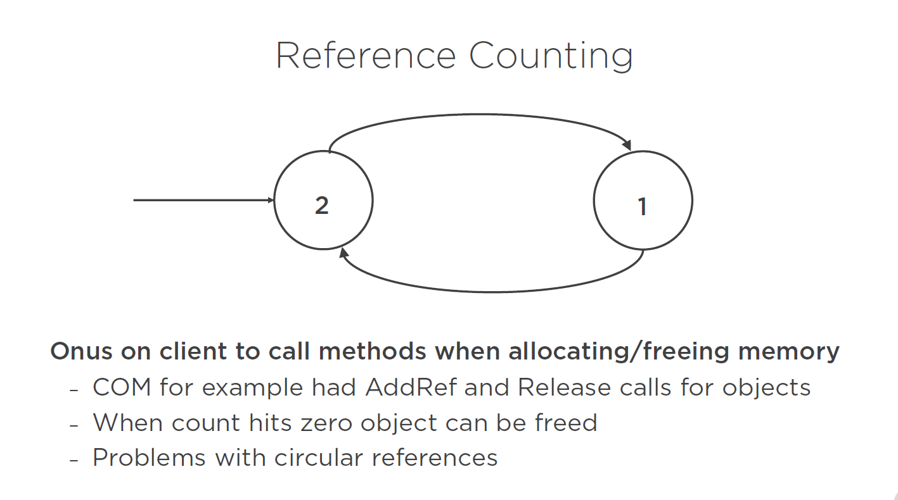
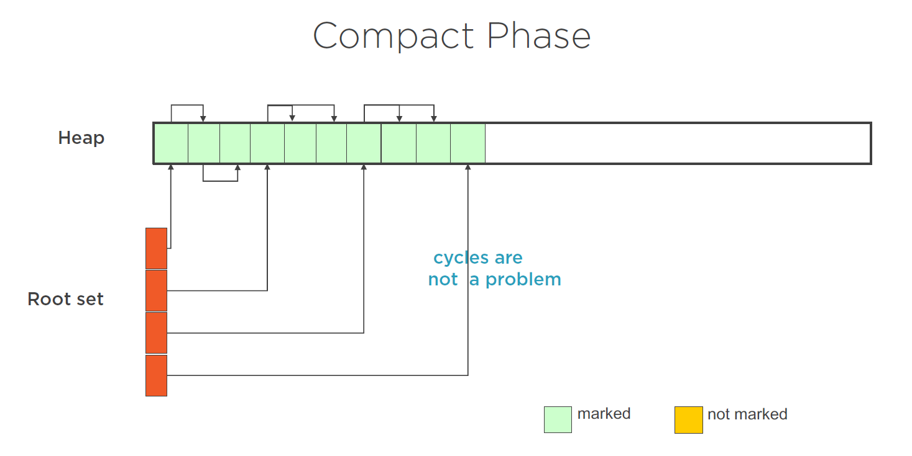

# 概述

在本文，我们将探索Java虚拟机中的垃圾收集和内存管理的各个方面，包括GC是如何工作的，我们如何与垃圾收集器进行交互，既可以从外部角度，即使用Java虚拟机为我们提供的一些工具，也可以使用虚拟机中的一些类与垃圾收集器进行内部交互。在我们这样做之前，我认为最好先了解一下我们为什么需要垃圾收集。在Java之前的语言中，比如`C`和`C++`，每当我们分配内存时，所以在这个例子中我们分配了一个对象，在某些时候，我们需要记住删除该对象并释放该内存。如果我们不这样做，我们就会出现内存泄漏。  
在Java中，情况并非如此。所以在Java中，我们可以分配一个对象，我们可以使用它，然后当这个对象不再被引用时，**垃圾收集器** 会释放该对象所使用的内存。还有一些围绕着 **谁应该删除一个对象** 的问题。所以在这里，我们调用一个叫做getAccount的方法，返回一个账户对象。实际上谁拥有这个对象？是账户对象的接收者，所以我有责任删除它吗？还是对象的给予者，即实现getAccount的那个东西。如果我们不清楚这一点，而且双方都不删除该对象，我们最终会出现内存泄漏。如果我们不清楚这一点，并且双方都删除了对象，我们就会在以后出现一些 **空指针异常**，这将是非常、非常难以追踪的。最后，我们可以有把握地使用对象。因此，只要我有一个对象的引用，垃圾收集器就不可能释放该内存。我将永远能够抓住那个对象并使用它。在其他环境中，比如`C++`，后台的一个线程可能会获取对该对象的引用并删除该对象。当我要使用它的时候，我知道一个指针什么都没有指向，我最终要么是内存损坏，要么是在代码的某个地方出现空指针异常，这又是一个非常、非常难以追踪的问题。

垃圾收集器做出了一个承诺，这个承诺就是他们声称没有活的对象。然而，垃圾收集器并没有对死对象做出承诺。他们可能会收集它们。他们可能不会。如果他们真的收集了它们，你不知道他们什么时候会运行，也就是说，这些内存什么时候会被回收。因此，我们分配了一个账户对象，我们做了新的账户，我们有一些东西，引用了一个包含该账户对象的内存块。如果在以后的某个阶段，我们采取同样的变量，把它指向一个新的账户，你现在就引用了一块新的内存和一个新的账户对象。我们所拥有的唯一保证，也是一个很好的保证，就是第二个账户对象将永远存在。只要我们有一个对它的引用，垃圾收集器就不会收集它。我们对旧账户对象没有任何保证。它不再被引用，它可能会被回收，但也可能不会。即使我们有一个像Java这样的环境，垃圾收集器会运行，我们也不知道它什么时候会运行，我们也不知道它是否会在我们的应用程序结束之前运行。

!!! Notes 
    Java版本: 本文代码基于Java11, 但同样支持Java8。

在Java 7中，G1垃圾收集器被引入。它实际上是在Java 6中产生的，但在Java 7中，它被正式提出。在Java 6中，它只是实验性的。所以在Java 9中，CMS垃圾收集器被弃用了，`finalizers`被弃用了，还有一个叫做`cleaner`的东西被引入了。但我在课程中仍然涵盖了所有这些东西。所以我仍然会提到`finalizes`，因为它们在Java 8中仍然被广泛使用。我仍然会提到CMS垃圾收集器，因为它仍然在Java 8中被广泛使用。我谈论`G1`垃圾收集器，因为那是从Java 7开始使用的。我还提到了`cleaner`，因为它从Java 9开始就被使用了。因此，希望无论你使用哪个版本的Java，都可以在本文了解差异。

+ Things changed in Java 7
  - G1 garbage collector introduced
+ Things changed in Java 9
  - CMS garbage collector deprecated
  - Finalizers deprecated
  - Cleaner introduced

### 不同类型的垃圾回收器
目前存在不同弄类型的垃圾收集器。
一种类型是什么都不做。垃圾收集器可能只是决定永远不运行，永远不做任何事情，没有内存被释放，但我们仍然有不收集活对象的保证，这显然是一件好事。
还有引用计数垃圾收集，一个很好的例子是COM编程环境。在COM中，应用程序会调用两个函数，`AddRef`和`Release`。`AddRef`增加一个对象的计数，而`Release`则减少一个计数。当该计数为 **0** 时，该对象不再被引用，该对象现在可以自我清理并从内存中删除。我们有标记和擦除垃圾收集器。在标记和擦除垃圾收集器中，当垃圾收集器运行时，它分两个阶段运行。标记阶段扫描内存，将这些对象在内存标记为存活。而擦除阶段则删除所有未使用的内存。这就给我们留下了可能是**碎片化**的内存。**复制的垃圾收集器**，通常在复制的垃圾收集器中，这将与类似标记和擦除收集器的东西一起工作。在这种情况下，在擦除阶段之后，所有剩下的内存被从一个缓冲区复制到另一个缓冲区。同时，一旦内存被复制，我们会重新排列，使其不再是碎片化的。我们也有generational garbage collectors。generational garbage collectors背后的想法是，如果一个对象在垃圾收集中幸存下来，它很可能是一个会存在很长时间的对象。在这种情况下，一旦一个对象在一次垃圾收集中幸存下来，垃圾收集器可能有一段时间不会再看它了，这就提高了垃圾收集器的性能。最后，还有增量式垃圾收集器。而事实上，生成式垃圾收集器是增量式垃圾收集的一种形式。所以，增量式垃圾收集器是一个在垃圾收集过程中不一直看所有内存的垃圾收集器。正如我们从中可以看到的那样，垃圾收集器往往不只是一种类型。所以我们倾向于在一个垃圾收集器中混合使用标记和擦除、复制、生成。

### 引用计数的垃圾收集

简单看一下引用计数的垃圾收集。这里我们展示的是引用计数垃圾收集器背后的想法。所以我们有两个对象。左边的对象的引用计数为2，右边的对象的引用计数为1。这些对象互相引用，这就提高了彼此的引用计数。这被称为**循环引用**，这就是引用计数垃圾收集器的问题之一。要摆脱循环引用是非常困难的。举例来说，一旦左边的引用消失，这两个对象的计数现在都是1， 然而这两个对象实际上都是垃圾，因为它们没有外部引用，这可能是一个非常难解决的问题。引用计数的工作方式是，一个给定的对象一旦被分配，它的引用计数就会被递增。而当它在去赋值时被取消引用，它的引用计数会被减去。当这个引用计数为0的时候，就像这里的第一个对象一样，这个对象就被释放了。当引用计数不为0时，该对象不会被释放。这也有一些问题。人们可能会忘记调用`AddRef`，比如说，增加引用计数。他们可能会忘记取消对象并减少引用计数。所以我们可能会出现内存泄漏。我们还可能出现这样的情况：有人减少了引用计数，但对象仍然在使用。这不是最理想的情况。

### 标记和擦除垃圾收集

标记和擦除垃圾收集器实际上通常有三个阶段，一个是识别仍在使用的对象的标记阶段，一个是清除未使用对象的擦除阶段，然后是在所有未使用对象被清除后压缩内存的压缩阶段。

这里我们有一个简单的内存块的图。在左边，我们有一个引用的根集。因此，这些是我们可以从一些根机制中跟踪的引用，也许是堆栈，它们指向活的内存。如果我们遵循根集的引用，任何引用另一个对象的对象也会保持该对象的活力。在标记阶段，垃圾收集器将从根集开始，依次走过每个对象，跟踪它的所有引用，标记内存中仍然活着的每个对象。注意，我们在这里可以有循环，而这些循环并不影响垃圾收集器。因此，如果一个对象引用了另一个对象，但它们没有根引用，这段内存可以被收集。在擦除阶段，垃圾被带走了，这就使得所有还在内存中的对象仍然被引用。然后，最后，这些内存被压缩。所以在这一点上，我们已经改变了内存的物理地址，这是关于垃圾收集器的一个重要观点。在Java这样的应用程序中，我们往往没有对对象的物理引用。我们在应用程序中会有一些引用，Java虚拟机在内部能够使用这些引用来获得这块内存的实际物理位置。但对我们来说，要真正得到那个物理位置是非常困难的。对于复制的垃圾收集器，事情略有不同。通常仍然有一个标记阶段和一个扫描阶段。所以在这里，比如说，我们有，一个内存块。这是在左边分配的，这就是我们当前所有对象被分配的地方。垃圾收集器的工作方式通常是当这个叫做fromspace的内存块变满时，垃圾收集器就会运行。同样，它遵循根集，并从根集开始标记所有的活对象。但是现在，在擦除阶段发生的事情是，这些对象被移到tospace中，因此同时被压缩。最后，从空间被清空。tospace和fromspace现在被交换了。下一块被分配的内存会被分配到这个新的fromspace中。最后，当它变得满了，整个过程又发生了。

### Generational Garbage Collection
We also have the idea of generational garbage collectors, and the idea here is that once an object survives a garbage collection, that object is promoted to a different generation. The garbage collector will sweep through the young generations more often than it sweeps through the older generations. And depending on the environment, there could be any number of different generations. So in Java, for example, there's two. In .NET, there are three. Again. in different environments, there might be two or more generations where the garbage collector manages to collect memory. So with the generational garbage collector, again similar to before, we have a block of memory into which we're allocating our objects. And again, that memory has become full. This is now our first generation or young generation. In that generation, we've allocated memory. Notice we also have an old generation where there may be objects that may be alive, may not be alive. Once the GC runs, all the objects, in this case 1, 2, 3, and 4, that survive a garbage collect will be moved to the old generation. We can then clear the young generation and then carry on allocating objects inside the young generation.

### Demonstrating How the Garbage Collection Works
So what I'd like to do is to run some code that's going to allocate some memory and then take the address of that memory in Java and print out the address of the memory. And the idea behind this is that as we print these addresses, we'll see that the memory address rises as we allocate more and more objects. And then eventually, the garbage collector will run and, at that point, will collect all the memory. The next allocation will go back to the same address as the previous allocation or close to the previous allocation at least. We have some code here. Let me run this first, and then I'll take you through the code. So the application is called Sawtooth. It's very simple. We're going to run this with a classpath. And if I run this code, we just see it prints out a large stream of numbers. And at the moment, just by looking at those numbers, we can't see too much. But those numbers are the addresses of the objects as they are being allocated. So let me kill that. If I come back into the code, we can see how this is going to work. So we're allocating an object called GCMe. And GCMe is defined here. GCMe is simply a large object. There's many longs in here. In fact, there are 18 of them. So that makes this quite a large object. And the reason for that is that when we allocate this, if it was a small object, we need to allocate many, many thousands of them before the garbage collector kicked in. As it's larger, we need to allocate fewer objects before the garbage collector kicks in. So if I look at the code that allocates the objects, you'll see there's a loop. Inside the loop, we allocate a new object, GCMe. We take the address of the object, you'll see how we do that in a moment, and then simply print out that address. To take the address of the object, we have a helper method called addressOf that just gets given an object. And this helper uses the Unsafe class. Now Unsafe is part of sun.misc.Unsafe. This is not a standard part of the Java runtime. It's an undocumented class, but you'll find this used quite often, and it's quite possible that this class will be included officially in the Java 9 runtime. There are many websites out there that tell us how to use Unsafe. But essentially, we have to get a reference to a singleton class. We can't do that directly as the class is a private constructor, and there's also security checks in place to stop us creating instances of this class. Once we have a reference to the class, we can then use it to get the address of an object. And here we're just seeing if the address size is 4 or 8, so I'll be running on the 32‑bit environment or 64‑bit environment and then using either getInt to get the address or getLong to get the address. And we simply return that address. So that's all the code is doing. So if we run this code again, we'll see the same output, again not very interesting. But what I'd like to do is to run this code and capture that output to a file. And we'll give this file a CSV extension so it'll act like a comma‑separated variable file. So I'll just call this out.csv. Once that file has being created, we can check the contents by using cat on out.csv, and that displays the same date as we saw being printed to the console. Again, not very exciting. However, what we can do is load that data into Excel. So in Excel, if we open up out.csv, again, all we see is a column of numbers. Now what we can do is if I highlight that column and insert a line graph, so I go to Graphs, Line, and that'll take that data. And as we can see, we got a sawtooth graph. And what this is showing is that we start allocating memory at a certain place inside the address space. We keep allocating, allocating, allocating, allocating. Eventually, we'll try and allocate some memory. We'll have no more space to allocate it. The garbage collector will kick in, that will free up the memory, and the next time we allocate memory is at some lower location inside the address space. And again, we run through the same process. We keep allocating until the garbage collector kicks in. And then when that happens, we run again, the GC runs, and we allocate the next piece of memory at the lowest point inside the address space, and off we go again. So hopefully this illustrates very simply what the GC is doing inside this application. We'll see later in this course that a far more sophisticated tool is out there for showing the garbage collector, but this is a nice, simple approach for showing what's happening.